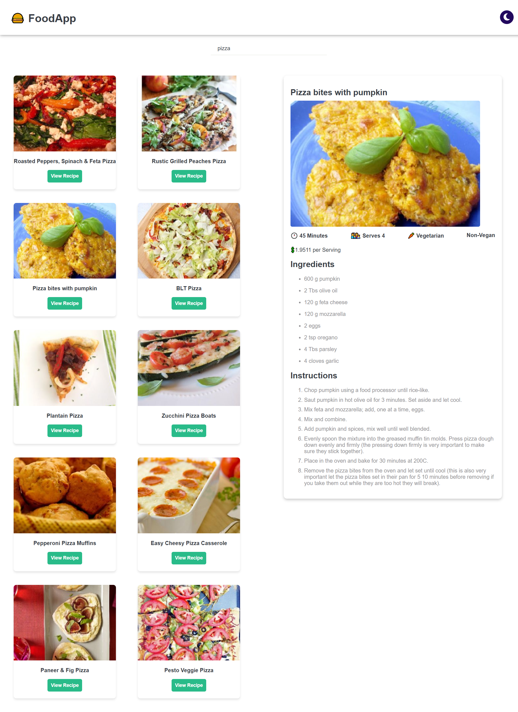

# About This Project 🚀 
**FoodApp** is a user-friendly platform designed to help food enthusiasts discover delicious recipes and cooking inspiration. Whether you're looking for a quick meal or exploring new culinary ideas, this app provides an intuitive interface to browse, explore, and get detailed instructions for a wide variety of recipes.

## Features 💡

- Search Functionality: Allow users to search for recipes based on keywords.
- Displays a collection of food recipes for users to browse.
- Provides detailed information about a selected recipe(preparation time, number of servings, dietary labels, and price per serving).
- Offers step-by-step cooking instructions.
- Lists all ingredients required for a recipe, allowing users to identify what they need for cooking.


## Tech Stack 🛠

* React
* Vanilla CSS
* React-router-dom
* Spoonacular API

## API Reference

#### Search recipes

```http
  GET https://api.spoonacular.com/recipes/complexSearch?query=${query}&apiKey=${API_KEY}
```

| Parameter | Type     | Description                |
| :-------- | :------- | :------------------------- |
| `API_KEY` | `string` | **Required**. Your API key to access the Spoonacular API.|
| `query` | `string` | **Required**. The (natural language) recipe search query.|

#### Get recipe information

```http
  GET https://api.spoonacular.com/recipes/{id}/information?apiKey=${API_KEY}
```

| Parameter | Type     | Description                       |
| :-------- | :------- | :-------------------------------- |
| `id`      | `number` | **Required**. Id of item to fetch |
| `API_KEY`      | `string` | **Required**. Your API key to access the Spoonacular API.|


## Run Locally 🚦

### Prerequisites

* Node.js installed on your local machine.
* npm or yarn to manage project dependencies.

### Instalation

* Clone the repository to your machine

```bash
  https://github.com/samyAkchiche/FoodApp.git
```
* Install dependencies :

if you're using npm:

```bash
  npm install
```

or, if you're using yarn:
```bash
  yarn install
```

* Open the URL displayed in your console using your web browser.:

```bash
  npm run dev
```

## Contributing

Contributions are welcome! If you want to contribute to the project:

1. Fork the repository.
2. Clone the repository.
```bash
git clone https://github.com/samyAkchiche/FoodApp.git
```
3. Create a new branch.
4. Make your changes.
5. Test your changes.
6. Commit your changes.
7. Push to your fork.
8. Submit a pull request

### Pull Request Guidelines

* Provide a clear description of the changes you have made in your pull request.
* Link any issues that your changes address. If you're fixing a bug, reference the issue number (e.g., `Fixes #42`).
* Follow the existing coding style of the project to ensure consistency.

### Issues and Feature Requests

If you find any bugs or would like to request new features, feel free to open an issue in the repository. Provide as much detail as possible, including steps to reproduce and error messages.


   
